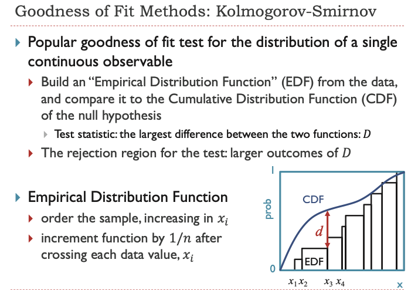
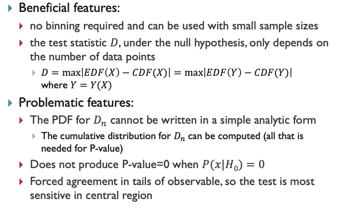
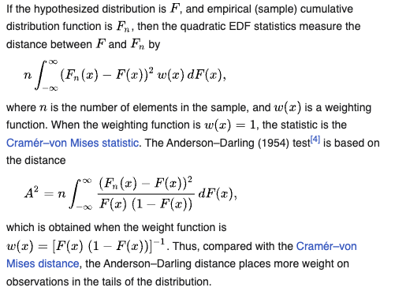

PHYS 515 - Data Analysis

## Moments of a distribution

#### Probability density of the normal distribution
$$
f(x | \mu, \sigma^2) = \frac{1}{\sqrt{2\pi\sigma^2}} \exp -\frac{(x-\mu)^2}{2\sigma^2})
$$
where $\mu$ is the mean, $\sigma$ is the standard deviation and $\sigma^2$ is the variance.

## Moments of distribution

**Literature:** Press etal. _Numerical Recipies_, Chapter 14.1

Moments are the sums of integer powers of data values $(x_1, x_2,
x_3, \dots, x_\mathrm{N})$. They characterize the distribution of data values if the data shows a sufficiently strong tendency to cluster around some particular value.

### Mean

$1^{st}$ moment:

$$
<x> = \bar{x} = \frac{1}{N} \sum_{j=1}^N x_j  
$$

### Variance/width

$2^{nd}$ moment:

$$
var(x_1, x_2, x_3, \dots, x_N) = \frac{1}{N-1} \sum_{j=1}^N (x_j - \bar{x})^2  
$$

and related to that the standard deviation:
$$
\sigma(x_1, x_2, x_3, \dots, x_N) = \sqrt{var(x_1, x_2, x_3, \dots, x_N)} 
$$

###  Skew

The $3^{rd}$ moment indicates the asymmetry of the distribution in
terms of a tilt:

$$
skew(x_1, x_2, x_3, \dots, x_N) = \frac{1}{N} \sum_{j=1}^N
\left(\frac{x_j - \bar{x}}{\sigma}\right)^3 
$$

### Kurtosis

Kurtosis is the $4^{th}$ moment of a distribution and measures the "tailedness" of the probability distribution of a real-valued random variable. It's an indicator of the presence of outliers.

$$
kurtosis(x_1, x_2, x_3, \dots, x_N) = \frac{1}{N} \sum_{j=1}^N \left(\frac{x_j - \bar{x}}{\sigma}\right)^4 
$$

where $\bar{x}$  is the mean of the data, $\sigma$ is the standard deviation, and $ N$ is the number of observations.

### Excess Kurtosis

Excess kurtosis is a measure used to describe the extent to which a distribution differs from the normal distribution in terms of kurtosis. It is calculated by subtracting 3 from the kurtosis. This adjustment is made because the normal distribution's kurtosis is 3. Therefore, the formula for excess kurtosis is:

$$
excess\_kurtosis(x_1, x_2, x_3, \dots, x_N) = kurtosis(x_1, x_2, x_3, \dots, x_N) - 3
$$

- If the excess kurtosis is greater than 0, the distribution has heavier tails than a normal distribution (Leptokurtic).
- If the excess kurtosis is less than 0, the distribution has lighter tails than a normal distribution (Platykurtic).

## Revisit _goodness of fit_ methods

From Dean Karlen's slides:

### Anderson-Darling Statistic

The Anderson-Darling statistic is used to measure how well the data follow a particular distribution [Wikipedia](https://en.wikipedia.org/wiki/Anderson%E2%80%93Darling_test#Tests_for_families_of_distributions). 

The formula for the Anderson-Darling statistic is:
$$
A^2 = -N - \frac{1}{N} \sum_{i=1}^{N} \left[ (2i - 1) \log(F(x_i)) + (2(N - i) + 1) \log(1 - F(x_i)) \right]
$$
where:
-  $N$  is the sample size.
-  $x_i$ are the sorted data points.
- $F $ is the cumulative distribution function (CDF) of the specified distribution.
- The data points $ x_i $ are assumed to be ordered from smallest to largest.

This statistic

*  places more emphasis on the tails of the distribution compared to similar tests like the Kolmogorov-Smirnov test. 
* tends to be more effective with larger samples
* _K\-sample Anderson–Darling tests_  for testing whether several collections of observations can be modelled as coming from a single population, which does not need to be specified

We explore this in the notebook `Distribution_testing.ipynb`.

Remember:

* Significance Level: In hypothesis testing, the significance level (denoted as $\alpha$) is the probability of rejecting the null hypothesis when it is actually true (a type I error or a false positive). A smaller $\alpha$ means you require stronger evidence to reject the null hypothesis.
* Critical Values and Test Statistics: In the context of the Anderson-Darling test, higher critical values correspond to more stringent (smaller) $\alpha$ levels. If your test statistic exceeds these higher critical values, it implies that the evidence against the null hypothesis (that the data follow a specified distribution) is strong enough to reject it, even at these lower probabilities of making a type I error.
* Confidence vs. Significance: Confidence generally refers to the probability that a parameter lies within a specified range (used in confidence intervals). Significance, in hypothesis testing, is about how strong the evidence must be to reject a null hypothesis. They are related but different concepts. A higher confidence level (like 95% or 99%) corresponds to a lower significance level (like 5% or 1%).
* When the test statistic is greater than the critical value at a small significance level (say 1%) there is strong evidence against the null hypothesis at a high confidence level (99% confidence). In other words, you can be more confident in asserting that your data do not come from the normal distribution.

## Data-analysis of 3D simulations
Next steps are:
* Let's have a look at the virtual research platform [ppmstar.org](https://www.ppmstar.org), for details see the first part of the notes [Parallel_computing.md]
* Experiment numerically with hypothesis testing in notebook `Distribution_testing.ipynb`
* Analyse velocity data in the notebook `Mollweide-HW1.py`
