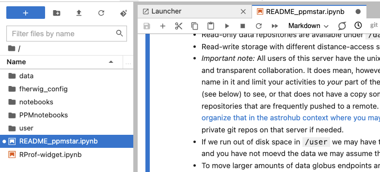
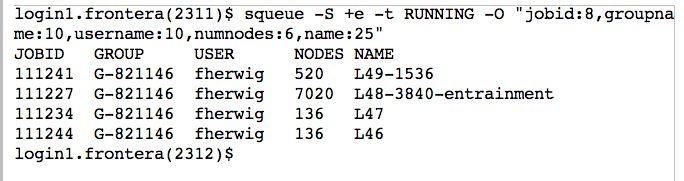
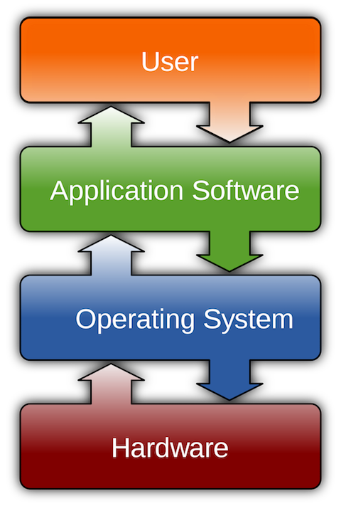

PHYS 515 - Data Analysis

## Access to virtual research platform
For the homework and assignemnt you will use the PPMstar virtual research platform at
https://www.ppmstar.org.

Use the _PPMstar Collaborate_ hub as shown below:


Log in with your github user name and when you get to the Spawner menu select the default option:


Have a look at the `README_ppmstar.ipynb` notebook for information on how the virtual research platform works. 



Most importantly: your home directory is not persitent. Make yourself a work directory in `/user/scratch14_ppmstar`. Clone the repository into that work space using the command line. Navigate to that directory in the JupyterLab file manager to the left of the JupyterLab screen.

Github repo: https://github.com/UVic-CompPhys/PHYS515


## Software and hardware


_Computer software, or simply [software](https://en.wikipedia.org/wiki/Software), is a collection of data or computer instructions that tell the computer how to work._ 

The software is executed on [computer hardware](https://en.wikipedia.org/wiki/Computer_hardware). Computer hardware examples:

#### Desktop


The core computing engine of the Desktop is the [central processing unit (CPU)](https://en.wikipedia.org/wiki/Central_processing_unit). Today, all CPUs have multiple cores.
Here is an example of an 8-core Haswell-E processor from Intel:


#### Supercomputer

As an example, below is a picture of one of _many_ rows of the [5th-fastest supercomputer](https://www.tacc.utexas.edu/-/frontera-named-5th-fastest-supercomputer-in-the-world) (in 2019) [Frontera](https://www.tacc.utexas.edu/systems/frontera) at [Texas Advanced Computing Center](https://www.tacc.utexas.edu):


You can think of a supercomputer as a very large room with racks with thousands of desktop computers (called nodes) that are all connected via [network cable connections](https://media.wired.com/photos/5c5241d895d28a2cb5b76db3/master/w_2560%2Cc_limit/Ai-Computer-MAIN.jpg). Each node has [dozens of CPU cores](https://en.wikipedia.org/wiki/Multi-core_processor). 
Canada's fastest academic supercomputer is [Niagara](https://docs.computecanada.ca/wiki/Niagara) operated by [SciNet](https://www.scinethpc.ca/) and [Compute Canada](https://www.computecanada.ca).

#### Using a supercomputer like Frontera

In order to use the combined computing power of a supercomputer like Frontera or Niagara one needs to write programs that execute many floating point operations and program parts _in parallel_. This approach is called [parallel computing](https://en.wikipedia.org/wiki/Parallel_computing). Parallel computing has various layers and technical implementations. At the lowest level is a parallism that is called [SIMD](https://en.wikipedia.org/wiki/SIMD) which stands for _single instruction multiple data_. It is the core idea of vector processing, and this is helped by avoiding loops in your programming.  

Here is a screenshot of the terminal output of the `sbatch` terminal command on the Frontera supercomputer on October 27, 2019. The command line options are such that the output contains certain quantities, formatted in a certain way. The command line options also ensure that **all** jobs running at the time are shown. [Frontera](https://www.tacc.utexas.edu/systems/frontera) has 8280 nodes in total. 


#### Software layers on top of the hardware

We can distringuish different layers in the computer infrastructure which together deliver an application to the user. The bottom layer is the hardware. It is controlled and interacted with via the operating system. On top of the operating system are one or more layers of application software. Finally the user is interacting with the _user-facing_ software application layer.

 


## Parallel and threaded programming

You will find example codes for this section in the repository in the directory `Parallel_code_examples`.

### Flynn's Taxonomy of Computer Architectures

Flynn's Taxonomy classifies computer architectures based on the number of instruction and data streams they handle simultaneously. It categorizes them into four types:

* SISD (Single Instruction, Single Data)
	- D: Traditional sequential computers.
	- O: Executes a single instruction on a single data stream.
	- E: Most classic sequential processors like early Intel x86 CPUs.
* SIMD (Single Instruction, Multiple Data)
	- D: Executes the same instruction on multiple data streams concurrently.
	- O: Useful for tasks with parallelizable operations like vector processing.
	- E: Graphics Processing Units (GPUs), all modern CPUs are vector processors.
* MISD (Multiple Instruction, Single Data)
	- D: Multiple instructions operate on a single data stream.
	- O: Rare in practice, mostly theoretical.
	- E: Certain fault-tolerant systems, pipelined processors, Space Shuttle flight control computer.
* MIMD (Multiple Instruction, Multiple Data)
	- D: Multiple autonomous processors executing different instructions on different data.
	- O: Common in modern parallel computing environments.
	- E: Multiprocessor systems, clusters, and supercomputers.

### Parallel metrics

* Latency and bandwidth
* Speedup, efficiency, cost
* Almdahl's law
  * find the maximum improvement in speed that can be achieved by parallelizing a portion of an algorithm
  * speedup of a program is limited by the time spent on the non-parallelizable portion of the task
  * Speedup = $1/(1-P)+P/N$ where $P$ is the proportion of the program that can be parallelized, and $N$ is the number of processors.


### SIMD: vector processing 

Vector processing is a form of parallel processing where a single instruction operates on multiple data (SIMD) points simultaneously. It is _really_ easy to implement in every-day programming! Just _avoid loops whenever possible_ and express your computation as much as possible in terms of vectors (arrays).

* **Increased Performance for Specific Tasks**: Vector processors are highly efficient at handling tasks that can be broken down into similar operations performed on large datasets. This includes tasks like matrix multiplications, graphics rendering, and scientific simulations, which benefit from processing multiple data points in parallel.
* **Simplified Programming for Parallelism**: Programming for vector processors can be simpler than for general-purpose parallel processing, as the parallelism is implicit in the vector operations. This can reduce the complexity of parallel code.
* **Reduced Memory Bandwidth Consumption**: By handling multiple data elements in a single instruction, vector processors can reduce the frequency of memory accesses, thereby alleviating memory bandwidth bottlenecks.
* **Scalability**: Vector processing is inherently scalable for certain types of applications. As the size of the data set increases, the same operations can be applied to larger vectors, making efficient use of the processor's capabilities.

In order to compute efficiently one may have to ask the computer to do more work and discard some. 

#### Example Python
```Python
import numpy as np
import time

# Initialize two large arrays
array_size = 1000000
array1 = np.random.rand(array_size)
array2 = np.random.rand(array_size)

# Vectorized addition
start_time = time.time()
vectorized_result = array1 + array2
end_time = time.time()
print("Vectorized operation time:", end_time - start_time)

# Loop-based addition for comparison
start_time = time.time()
loop_result = np.zeros(array_size)
for i in range(array_size):
    loop_result[i] = array1[i] + array2[i]
end_time = time.time()
print("Loop operation time:", end_time - start_time)

# Verify the results are the same
assert np.allclose(vectorized_result, loop_result)
```
Which produces the following output:
```
Vectorized operation time: 0.0032699108123779297
Loop operation time: 0.20131731033325195
```

### MIMD: MPI in Fortran

MIMD (Multiple Instruction, Multiple Data) parallel processing in Fortran typically involves the use of MPI (Message Passing Interface), a standard library for parallel programming. Key concepts are

* message passing
* broadcast
* scatter and collect
* reduce
* barrier

Here is an example: 

```fortran
program hello_mpi
    use mpi
    implicit none

    integer :: rank, size, ierr

    call MPI_INIT(ierr)                            ! initialize the MPI environment
    call MPI_COMM_SIZE(MPI_COMM_WORLD, size, ierr) ! total number of processes
    call MPI_COMM_RANK(MPI_COMM_WORLD, rank, ierr) ! rank (identifier) of each process
		! each process performs code below
    print *, 'Hello world from process ', rank, ' of ', size

    call MPI_FINALIZE(ierr)                        ! clean up the MPI environment
end program hello_mpi
```

* safe into file with name `mpi_example.f90`
* load `mpi` and `fortran` compiler modules 
  * on cluster find with `module spider` command
  * on Niagara:


```bash
module load gcc
module load openmpi/4.1.4
```

* Compile: `mpif90 mpi_example.f90 -o mpi_example.exe`
* Run: `mpirun  -n 4 mpi_example.exe`
* Each process, potentially on different machines, executes the program independently

Output:

```
fherwig/PHYS515$ mpirun  -n 4 mpi_example.exe 
 Hello world from process            1  of            4
 Hello world from process            3  of            4
 Hello world from process            2  of            4
 Hello world from process            0  of            4
```

But is this really faster? Let's try a Monte-Carlo computation of $\pi$ and check for the scaling.

```fortran
program mpi_monte_carlo_pi
    use mpi
    implicit none

    integer :: rank, size, ierr, i, count, total_count
    integer, parameter :: num_samples = 1000000
    double precision :: x, y, pi_estimate, start_time, end_time
    double precision, external :: drand48

    call MPI_INIT(ierr)
    call MPI_COMM_SIZE(MPI_COMM_WORLD, size, ierr) ! total number of processes
    call MPI_COMM_RANK(MPI_COMM_WORLD, rank, ierr) ! ID of process
    call MPI_BARRIER(MPI_COMM_WORLD, ierr)         ! synchronize all processes for timing
    start_time = MPI_WTIME()

    count = 0
    do i = 1, num_samples / size
        call random_number(x)
        call random_number(y)
        if (x**2 + y**2 <= 1.0d0) then
            count = count + 1
        end if
    end do
    
		! reduction operation (like summation, maximization, minimization, etc.) 
		! across all processes within a communicator
    call MPI_REDUCE(count, total_count, 1, MPI_INTEGER, MPI_SUM, 0, MPI_COMM_WORLD, ierr)

    if (rank == 0) then
        pi_estimate = 4.0d0 * total_count / num_samples
        print *, 'Estimated Pi:', pi_estimate
        end_time = MPI_WTIME()
        print *, 'Parallel computation time:', end_time - start_time
    end if

    call MPI_FINALIZE(ierr)
end program mpi_monte_carlo_pi

```

 `MPI_REDUCE` aggregates the results from all processes:

`count`: This is the input variable. Each process provides its own `count` value, representing its portion of the computation (e.g., the number of points within a quarter circle in a Pi estimation calculation).

`total_count`: This is the output variable on the root process where the result of the reduction operation is stored.

`1`: This indicates the number of elements in the input and output variables. In this case, it's one because `count` and `total_count` are single integer values.

`MPI_INTEGER`: This specifies the data type of the elements being reduced. Here, it indicates that the elements are integers.

`MPI_SUM`: This is the reduction operation to be applied. `MPI_SUM` denotes that the values from all processes will be summed up.

`0`: This is the rank of the root process in the communicator. The root process is the one that will receive the final result of the reduction. In this case, process 0.

`MPI_COMM_WORLD`: The communicator over which the reduction operation is to be performed.

`ierr`: An error code variable that stores the status of the operation.

#### Activity

* Demonstrate on `ppmstar.org#ppmstar` hub
* Expand program to add additional work
* Consider what makes additional work
  * specifically things the compiler cannot easily optimize
  * How many flops needed for different operations

| Operation | Approx. FLOPs |
| --------- | ------------- |
| +, -, *   | 1             |
| /         | 4-6           |
| sqrt      | 10-20         |
| sin, cos  | 20-50         |
| exp       | 10-40         |
| log       | 10-50         |
| tan, atan | 20-80         |


### Shared Memory Parallelism

* MPI can spread processes over several nodes. It actively manages memory by sending each process their own copy, no matter where they are.
* Instead: shared memory parallelism is used for shared memory systems: all processors (or threads) have access to a common memory space. Typically, this is implemented with OpenMP. 

```Fortran
program openmp_monte_carlo_pi
    use omp_lib
    implicit none

    integer :: num_samples, i, count, total_count, num_threads, thread_id
    double precision :: x, y, pi_estimate, start_time, end_time
    double precision :: random_number

    ! Number of Monte Carlo samples
    num_samples = 1000000

    ! Initialize total count
    total_count = 0

    ! Start timing
    start_time = omp_get_wtime()

    ! Parallel region with OpenMP
    !$omp parallel private(x, y, i, count, thread_id) shared(num_samples, total_count) default(none)
    count = 0
    thread_id = omp_get_thread_num()

    ! Each thread works on a subset of the samples
    !$omp do
    do i = 1, num_samples
        call random_number(x)
        call random_number(y)
        if (x**2 + y**2 <= 1.0d0) then
            count = count + 1
        end if
    end do
    !$omp end do

    ! Reduce the counts from all threads into total_count
    !$omp atomic
    total_count = total_count + count

    !$omp end parallel

    ! Estimate Pi
    pi_estimate = 4.0d0 * total_count / num_samples

    ! End timing
    end_time = omp_get_wtime()

    ! Print results
    print *, 'Estimated Pi:', pi_estimate
    print *, 'Parallel computation time:', end_time - start_time
end program openmp_monte_carlo_pi
```

Compile with

```bash
gfortran -fopenmp openmp_monte_carlo_pi.f90 -o openmp_pi
```

and run with 

```bash
export OMP_NUM_THREADS=4
./openmp_pi
```

A very powerful approach is to combine OpenMP and MPI into a hybrid code. For example, in the code above we could replace the work done by each MPI process by

```fortran
    ! Parallel region using OpenMP                                                   
    !$omp parallel private(x, y, i) reduction(+:local_count)                         
    ! note that we are not seeding the random generator correctly as we should       
    !$omp do                                                                         
    do i = 1, num_samples_per_process
        call random_number(x)
        call random_number(y)
        if (x**2 + y**2 <= 1.0d0) then
            local_count = local_count + 1
        end if
    end do
    !$omp end do                                                                     
    !$omp end parallel                                                               
```

* Set number of OpenMP threads with `export OMP_NUM_THREADS=4`
* Compile with `mpif90 -fopenmp`
* Run with `mpirun -n 4 ` as usual

### When is shared memory (OpenMP) advantageous, and when is distributed memory (MPI) better?

**Shared memory parallelism** is most effective when all threads need access to shared data structures with frequent updates or global dependencies. It avoids inter-process communication overhead, for example:

1. **N-Body or Molecular Dynamics:**
   Pairwise interactions between \( N \) particles require access to global positions and velocities:

$$
F_{ij} = G \frac{m_i m_j (r_j - r_i)}{|r_j - r_i|^3}.
$$

2. **Radiative Transfer:**
   Solving the radiative transfer equation requires integrating shared data across spatial or angular grids:
   $$
   \frac{dI_
   u}{dx} = -\kappa_
   u I_
   u + \kappa_
   u S_
   u.
   $$

3. **Poisson Equation:**
   Iterative solvers like Gauss-Seidel update shared arrays for the potential:
   $$
   \frac{d^2\Phi}{dx^2} = \frac{\Phi_{i-1} - 2\Phi_i + \Phi_{i+1}}{dx^2} = 4 \pi G 
   \rho_i.
   $$

**Distributed memory** excels when the problem can be partitioned into independent domains with minimal overlap or communication, enabling scalability across nodes, for example:

1. **Finite Element Analysis (FEA):**
   Partitioning a mesh into subdomains, where boundary values are exchanged between processes during global assembly.

2. **Monte Carlo Simulations:**
   Independent random samples are distributed across processes with minimal communication needs.


#### Summary
Use **OpenMP** when the problem requires frequent shared access to data (e.g., global arrays). Use **MPI** when the problem can be partitioned into largely independent subdomains (e.g., domain decomposition). The choice depends on the problem's data dependencies and scaling requirements.


### Further MIMD distinction

* SPMD: Single Program, Multiple Data

  * same program replicated across multiple processors or cores operate on different data
  * e. g. same set of operations is applied to different parts of a grid or dataset, as in Cartesian 3D hydro on a uni grid
* MPMD: Multiple Program, Multiple Data

  * different processors may run different programs on different data sets
  * simulation that involves both computation-intensive and data-intensive tasks, where some processors run computation-heavy algorithms while others handle data processing or analysis
  * e. g. most processes do computation in teams, but team leaders or admins do data compression, prepare images, and perform in-code pre-processing
  * this can substantially reduce data storage needs
* _Embarrasingly parallel_ tasks  
  *  little or no effort is needed to separate the problem into a number of parallel tasks that require no communication among them
  * often SPMD, only challange may be _load balancing_ if tasks are different length

## Threading in Bash

Bash is a common 

* User interface for accessing an operating system's services at the _terminal_
* But is is also a powerdul scripting language that allows users to write complex programs (scripts) that can automate tasks, manage system operations, and more.

Common concepts for efficiency are threading (using multiple processes), caching and indexing, pre-empting, prioritization and load balancing. 

Analyse the Bash script `dir_analyzer.sh` to discuss some of these concepts.

In Bash threading can be implemented with

* GNU Parallel: command-line tool to execute jobs in parallel dealing with multiple tasks that can be run concurrently
* `xargs`: constructs and executes command lines from standard input, for example `find . -type f -name "*.tmp" | xargs rm`

## Threading in Python

There are more than one way and approaches, libraries and implementations are evolving. The approach used depends, for example, on whether it is I/O intensive or flops intensive 
* `mpi4py`: for parallel tasks that need to run on multiple machines or nodes in a cluster, can do complex communications
* `multiprocessing`: for CPU-bound tasks, creates separate Python processes, each with its own Python interpreter and memory space; to run on shared-memory machines, thus good for threading on one node

Look at examples `Mollweide.py` for `multiprocessing` and examples `mpi4py_example.py` and `mpi_MCpi.py` in directory `Parallel_code_examples`.

## Slurm and queuing on large machines

Don't be afraid of the queue. It is a wonderful tool and gives you access to a very large amount of computing resources, much, much larger than your laptop. If you think you don't need it think twice. 

These are examples from the Digital Alliance computer _niagara_ but they would work very similar or identical on other big compute clusters, such as `cedar`.

* Request an interactive node: `debugjob` 
* If you need more than one or for a longer time try adding this function to your `.basrhc` or `.bash_alias`

```shell
int_node(){
    if [ -z "$1" ]
    then
        time_min=30
    else
        time_min=$1
    fi
    salloc --time=$time_min:00 --nodes=1 --account=rrg-fherwig-ad
}
```

* `squeue`, `sbatch`, `scancel` 
* The _batch_ script

```Bash
#!/bin/bash                                                                                                       
#SBATCH --nodes=1                                                                                                 
#SBATCH -t 1:00:00                                                                                                

module load  NiaEnv/2019b

. /scinet/conda/etc/profile.d/scinet-conda.sh
scinet-conda activate $PROJECT/PythonVirtual/sciconda-astrohub2

time python3 ./Mollweide.py
```

* Submit with `sbatch run_slurm.sh`

