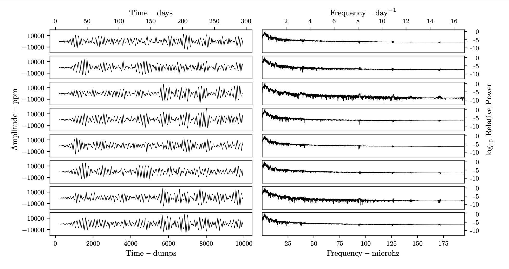
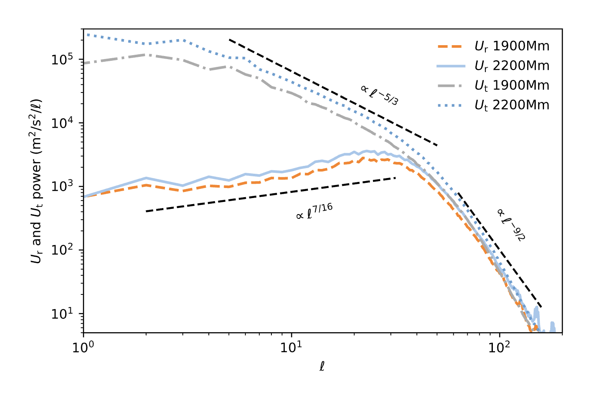

# Spectral analysis

A spectrum describes how a signal's amplitude or power is distributed across different frequencies. To be distinguished are spectral analysis in space and spectral analysis in time.

* **Spatial spectrum:** A spatial spectrum, also known as a spatial frequency spectrum or simply a "spectrum in space" characterizes how a physical quantity varies across different positions or spatial coordinates in a given region or space.
* **Temporal spectrum:** A temporal spectrum, also known as a temporal frequency spectrum or a "spectrum in time," is used to analyze how the amplitude or power of a signal varies with time.

## Spectral Analysis in Time: Fourier Analysis

Analyze time-series signals and decompose them into their constituent sinusoidal components. Any complex, time-varying signal can be represented as a sum of simple sinusoidal functions, each with a specific frequency, amplitude, and phase. These sinusoidal functions are called harmonics or Fourier components. The Fourier Transform converts a time-domain signal into its frequency-domain representation. It provides information about the amplitude and phase of sinusoidal components at different frequencies present in the signal.

### Mathematical Formulation
The continuous Fourier Transform of a time-domain signal $x(t)$ is [defined as follows](https://en.wikipedia.org/wiki/Fourier_transform):

$$
X(f) = \int_{-\infty}^{+\infty} x(t) \cdot e^{-j2\pi ft} dt
$$

Where:
- $X(f)$ is the complex amplitude of the signal at frequency $f$.
- $x(t)$ is the input signal.
- $e^{-j2\pi ft}$ represents a sinusoidal component at frequency $f$.

### Discrete Fourier Transform (DFT)
In practice, we often deal with discrete data sampled at regular intervals. The [Discrete Fourier Transform (DFT)](https://en.wikipedia.org/wiki/Discrete_Fourier_transform) is used to perform Fourier analysis on such data. The DFT equation is:

$$
X[k] = \sum_{n=0}^{N-1} x[n] \cdot e^{-j2\pi kn/N}
$$

Where:
- $X[k]$ is the complex amplitude at frequency $k/N$ ($k$ is an integer).
- $x[n]$ is the discrete signal at time step $n$.
- $N$ is the number of data points.

The index $k$ ranges from $0$ to $N-1$ and corresponds to different frequency components in the signal.

### Example
[Fig. 4, Thompson et al. 2024](https://ui.adsabs.harvard.edu/abs/2024MNRAS.531.1316T) shows the temporal spectra (right column) of the simulated luminosity variations (shown in the left column) from a 3D hydrodynamic simulation, at a given radius, in different directions (the different rows). The power peaks at $2$ to $3\mu Hz$ which corresponds roughly to the convective frequency in the system. 

## Spectral Analysis in Space: Spherical Harmonics

Spherical harmonic decomposition is used to represent a function defined on the surface of a sphere in terms of spherical harmonics. Spherical harmonics ($Y_l^m(\theta, \phi)$) are a set of orthonormal functions defined on the unit sphere. They are characterized by two quantum numbers: $l$ and $m$, where $l$ is the degree and $m$ is the order. Spherical harmonics describe angular variations in systems that are spherically symmetric in their overall structure but may have perturbations or variations.

The [formula for spherical harmonics](https://mathworld.wolfram.com/SphericalHarmonic.html) is given by:
$$
Y_l^m(\theta, \phi) = \sqrt{\frac{2l + 1}{4\pi} \frac{(l - m)!}{(l + m)!}} P_l^m(\cos \theta) e^{im\phi}
$$
Where:
- $P_l^m(\cos(\theta))$ are associated Legendre polynomials.
- $e^{im\phi}$ represents the azimuthal dependence.

The decomposition of a spherically symmetric function $f(\theta, \phi)$ into spherical harmonics [is given by](https://scipp.ucsc.edu/~haber/ph116C/SphericalHarmonics_12.pdf):
$$
f(\theta, \phi) = \sum_{l=0}^{\infty} \sum_{m=-l}^{l} a_{lm} Y_l^m(\theta, \phi)
$$
Where:
- $a_{lm}$ are the expansion coefficients that determine the contribution of each spherical harmonic to the function $f(\theta, \phi)$.

To represent a spherically symmetric function $f(\theta, \phi)$ in terms of spherical harmonics, we calculate expansion coefficients $a_{lm}$. These coefficients quantify the contribution of each spherical harmonic to the function. The calculation is done using the following formula:

$$
a_{lm} = \int\int f(\theta, \phi) \cdot Y_l^{m*}(\theta, \phi) \, \sin(\theta) \, d\theta \, d\phi
$$

Where:
- $a_{lm}$ is the expansion coefficient for the spherical harmonic $Y_l^m$.
- $f(\theta, \phi)$ is the spherically symmetric function to be decomposed.
- $Y_l^{m*}(\theta, \phi)$ is the complex conjugate of the spherical harmonic $Y_l^m$.
- $\sin(\theta) d\theta d\phi$ is the solid angle $d \Omega$.
- The double integral is performed over the entire sphere.

### Example

[Fig. 20 in Herwig et al. 2023](https://ui.adsabs.harvard.edu/abs/2023MNRAS.525.1601H) shows the spatial spectra at a given radius of the horizontal and radial velocity component. While the radial component peaks at angular degree  $l \approx 30$ the tangential velocity component  has most power at very low angular degree $l$.

##  Next steps
* Look at some examples for both temporal and spatial spectra in notebook `Spectra_HW3.ipynb`